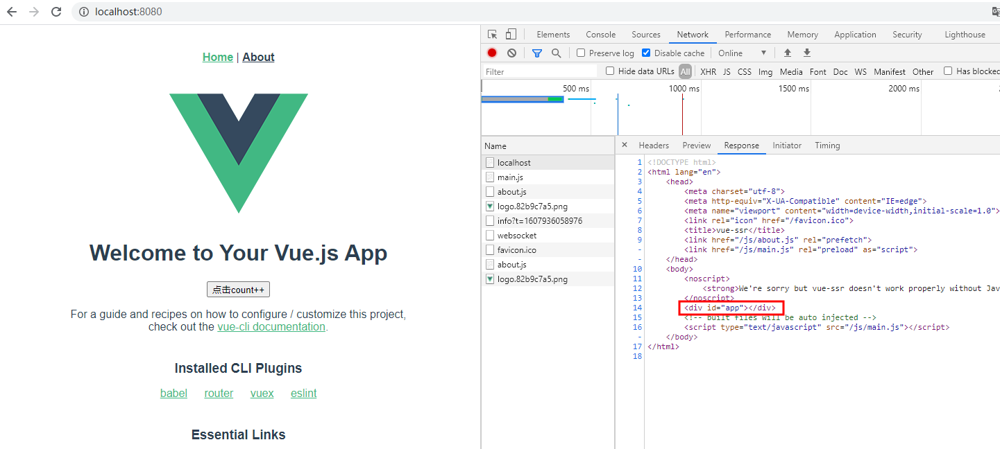
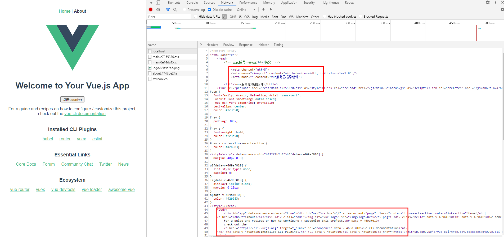
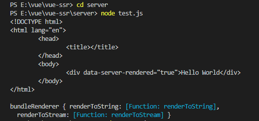
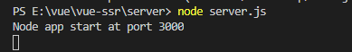
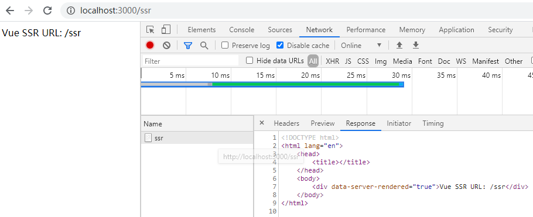

# vue-ssr

> 基于vue-cli3搭建的vue项目改造成SSR服务端渲染项目

## 项目启动
```
# 下载依赖
yarn

#本地调试页面
yarn serve

# 打包
# PS: 打包后可以把dist目录下的index.html文件删了,避免直接访问到了该html文件
yarn build:win

# 启动SSR服务端渲染项目
node server.js
```
yarn serve本地调试：<br>
<br>

yarn build:win & node server.js<br>


### 项目结构
1、resource文件夹为README.md说明图片
2、server文件夹为测试文件夹，可删除，查看效果
```
cd server
node test.js

node server.js
```
<br><br>
<br>


### 项目搭建
1、Vue SSR官网API：[https://ssr.vuejs.org/zh/](https://ssr.vuejs.org/zh/)
<br>
2、可先使用vue2按照以下方式搭建项目，根据需求是否选择typescript：[https://segmentfault.com/a/1190000019905650](https://segmentfault.com/a/1190000019905650) 
<br><br>
3、SSR项目改造博文参考：
- [https://www.cnblogs.com/tugenhua0707/p/11048465.html](https://www.cnblogs.com/tugenhua0707/p/11048465.html)
- [https://www.jb51.net/article/147323.htm](https://www.jb51.net/article/147323.htm)
- [https://blog.csdn.net/weixin_40965293/article/details/106619172](https://blog.csdn.net/weixin_40965293/article/details/106619172)


4、项目说明：
- 新增安装的包
```
vue-server-renderer

# server.js 需要
express / koa koa-router koa-static koa-send

# 用于package.json构建命令
cross-env 

# vue.config.js配置文件需要
webpack-node-externals lodash.merge
```

- 项目文件
```
├─dist 打包后文件夹
│  ├─......
│  ├─vue-ssr-client-manifest.json
│  └─vue-ssr-server-bundle.json
├─public
├─src
│    ├─assets
│    ├─components
│    ├─router 改成导出一个 createRouter 函数
│    ├─store  改成导出一个 createStore 函数
│    ├─views
│    ├─App.vue
│    ├─entry-client.js 新增 挂载客户端应用程序 文件
│    ├─entry-server.js 新增 挂载服务端端应用程序  文件
│    ├─index.template.html 新增 html
│    └─main.js 改成导出一个 createApp 函数
├─server.js 新增SSR服务端渲染配置文件
└─vue.config.js 添加配置文件
```
- package.json命令说明
```
# 将服务器端Json文件移出dist
move dist\\vue-ssr-server-bundle.json bundle

# 将服务器端Json文件移回dist
move bundle dist\\vue-ssr-server-bundle.json

# 删除dist目录下index.html文件
rimraf dist\\index.html
```
